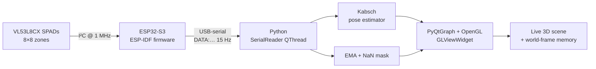
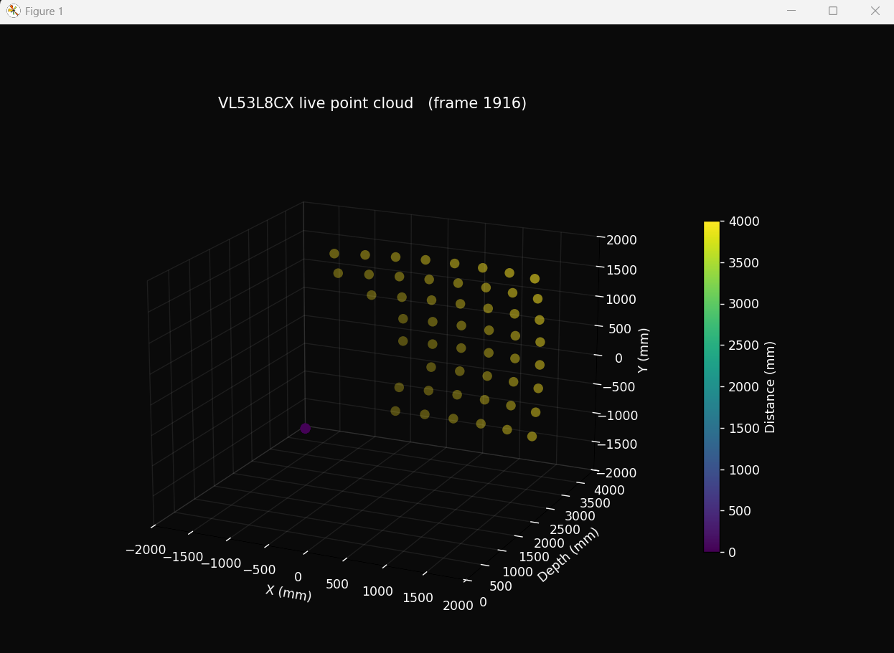

<h1 align="center">VL53L8CX × ESP32-S3 — Live 3D Point Cloud</h1>

<p align="center">
  <em>An 8×8 time-of-flight depth grid streaming over serial at 15 Hz, rendered in real time as a GPU-accelerated 3D point cloud with experimental 6-DOF pose tracking and a world-frame point memory. Foundation for an assistive helmet with IMU fusion next.</em>
</p>

<p align="center">
  
  
  
  
  
</p>

---

<p align="center">
  <video src="visualizer/progress_demo_v6.mp4"
         controls muted autoplay loop playsinline width="840">
  </video>
</p>
<p align="center"><em>v6 — accumulated past observations slide off to the side as the sensor pans, the cone effectively wraps around. Trail behind the sensor fades from invisible at the tail to bright yellow at the head. Live at 15 Hz.</em></p>

---

## What it does

An ESP32-S3 talks to an **ST VL53L8CX** time-of-flight sensor over I²C, uploads ST's ULD firmware to the chip on boot, and streams the 64-zone depth grid as compact `DATA:d0,d1,…,d63\n` lines over USB-serial at 15 Hz. A Python visualiser reads those lines and renders the scene live — animated ToF rays from the sensor body, a side colour-bar with the distance scale, a Kabsch-based 6-DOF pose estimator, and a world-frame point memory that builds a rolling 3D scan as the sensor sweeps.

---

## The hardware

<p align="center">
  
  &nbsp;&nbsp;
  
</p>
<p align="center">
  
</p>
<p align="center"><em>SATEL-VL53L8CX breakout on an ESP32-S3-DevKitC-1. 2 × 1 kΩ pull-ups in series on each I²C line, 10 kΩ on PWREN, sensor powered from 3.3 V.</em></p>

---

## The transformation — matplotlib → PyQtGraph

The visualiser was rewritten three times in a single weekend. The first cut used matplotlib `mplot3d`; mouse rotation was sluggish and the renderer was always one frame stale. v3 swapped in PyQtGraph + OpenGL, threaded the serial reader, and flipped the drain order. The clip below is 3 seconds of the original, then 7 seconds of v3:

<p align="center">
  <video src="visualizer/progress_demo.mp4"
         controls muted autoplay loop playsinline width="780">
  </video>
</p>
<p align="center"><em>Before / after — the same data on the same hardware, rendered through two different pipelines.</em></p>

| | v1 / v2 (matplotlib) | v3 (PyQtGraph) |
|---|---|---|
| Renderer | software-rendered `mplot3d` | GPU `GLViewWidget` + OpenGL |
| Mouse rotation | sluggish (GUI thread starved) | native — pan/zoom decoupled from data |
| Serial read | on GUI thread; 1 s timeout could stall | dedicated `QThread` with Qt signal |
| Drain order | read → process → drain (always one stale) | drain first, render newest valid frame |
| Smoothing | EMA α = 0.3 (~900 ms settle) | EMA α = 0.6 (~300 ms settle) |
| Invalid zones | drawn as a phantom 4 m back-wall | masked to NaN, drawn transparent |

---

## Architecture



---

## What you're looking at

<p align="center">
  <video src="visualizer/progress_demo_v4.mp4"
         controls muted autoplay loop playsinline width="780">
  </video>
</p>
<p align="center"><em>v4 in motion — sensor body, FoV frustum, animated ToF beams. Same scene as v6 but without the world-frame memory layer, so it's easier to identify each element on its own.</em></p>

| Element | What it is |
|---|---|
| **64 bright dots in a cone** | Live measurements, one per zone, coloured by distance (viridis: purple = close, yellow = far). |
| **Animated coloured beams from the sensor** | One ToF ray per zone, faded from the lens out to its endpoint, in the same hue as the point. They pulse with the live data — physically what a multizone ToF sensor is doing. |
| **Faded surrounding cloud** *(v6)* | Past observations in **world frame**, transformed back into the current sensor frame each tick and faded by age (~6 s memory). As you rotate, they slide off to the side instead of staying glued to the front. |
| **Yellow line behind the sensor** *(v5+)* | Estimated 6-DOF trajectory of the sensor's origin (last ~5 s), per-vertex alpha-faded so old segments disappear. |
| **Sensor body + lens ring at origin** | Flat dark rectangle modelling the SATEL-VL53L8CX face, with a bright lens circle and "VL53L8CX" label. |
| **Pale frustum** | The sensor's actual 45° × 45° field of view (per ST datasheet — 65° diagonal). |
| **Side colour bar** | Distance scale in mm. |
| **Status bar** | Live frame count, valid-zones / 64, mean valid distance, cumulative pose translation + rotation, and the per-frame rejection count. |

---

## Iteration story — v1 → v6

| Version | What it added | Why |
|---|---|---|
| **v1** | First working matplotlib 3D scatter. | Get *anything* on screen. |
| **v2** | In-place scatter update; serial-buffer drain; EMA smoothing. | Killed flicker, stale data, noise jitter. |
| **v3** | PyQtGraph + OpenGL; threaded serial; drain-first; α = 0.6; invalid-zone mask. | Fixed mouse-drag lag and one-frame-stale render. |
| **v4** | Side colour bar; X / Y / Depth axes; sensor body; FoV frustum; **animated ToF beams**. | Restored the "scientific" look + made the physics legible. |
| **v5** | **Kabsch / Procrustes 6-DOF relative pose estimator** with sanity gates and a trajectory trail. | First motion estimate from depth alone, no IMU. |
| **v6** | World-frame point memory (~6 s) re-projected each tick into the current sensor frame; per-vertex alpha-faded trail. | Makes the point cloud wrap around the sensor as it rotates instead of being glued to the front cone. |

For the full development log — every problem hit, every fix and the evidence behind it, every dead end — see [`PROGRESS.md`](PROGRESS.md).

---

## How the visualiser works

### Serial protocol
The ESP32 streams one compact line per frame:
```
DATA:820,815,801,790,...,(64 values total)
```
Invalid zones are clamped to `MAX_DISTANCE_MM` (= 4000 mm) on the firmware side, so the host always gets exactly 64 values. The visualiser detects the clamp and renders those zones with `α = 0`, hiding them. ESP_LOG lines in the same stream don't start with `DATA:` and are simply ignored by the parser.

### Threaded read pipeline
Serial reads run in a dedicated `QThread`; new frames are delivered to the GUI via a Qt signal. Each cycle drains everything currently buffered and keeps only the **newest** valid `DATA:` line — which kills the "rendering one frame stale" failure mode of the original `read → process → drain` order.

### Geometric projection
The VL53L8CX is **65° diagonal / 45° per axis**. Each of 8 zones along an axis subtends `45° ÷ 8 = 5.625°`. A unit direction vector is precomputed for every zone:

```text
h_angle = (col − 3.5) × 5.625°       v_angle = (row − 3.5) × 5.625°
x =  sin(h_angle)
y = −sin(v_angle)                     (row 0 is the top of the sensor view)
z =  cos(h_angle) × cos(v_angle)      (sensor boresight = +Z)
```

Multiplying each unit vector by its zone's measured distance gives the 3D point in the sensor's body frame.

### EMA smoothing
Raw zones jitter ±10–30 mm frame-to-frame on a static scene. Per-zone exponential moving average:

```python
smoothed[v] = 0.6 * new[v] + 0.4 * smoothed[v]
```

α = 0.6 settles to 95 % of a step input in `−ln(0.05) ÷ −ln(1 − 0.6) ≈ 3` samples — about 200 ms at 15 Hz.

### 6-DOF relative pose (Kabsch / Procrustes)

Closed-form rigid registration on consecutive 64-point clouds. Given paired sets P (frame k−1) and Q (frame k):

```text
1.  Pc, Qc      = P − mean(P), Q − mean(Q)
2.  H           = Pc.T @ Qc
3.  U, S, Vt    = svd(H)
4.  d           = sign(det(Vt.T @ U.T))         # reflection guard
5.  R           = Vt.T @ diag(1, 1, d) @ U.T
6.  t           = mean(Q) − R @ mean(P)
```

The fitted (R, t) maps a world point's old-frame coords to its new-frame coords. The **sensor's** per-frame motion is the inverse: `δR = R.T`, `δt = −R.T @ t`. World-frame cumulative pose composes as `T_world(k) = T_world(k-1) · δ`.

Same-zone correspondence relies on the small-motion assumption — at 15 Hz (~67 ms per frame) zone *i* in two consecutive frames still observes approximately the same world point. Wrong correspondence (fast motion) shows up as huge fitted Δt or ΔR; the estimator gates on `≤ 300 mm` and `≤ 20°` per frame and breaks the chain instead of corrupting cumulative state.

### World-frame point memory (v6)

Each frame, valid sensor-frame points are transformed via `world_p = R_world · sensor_p + t_world` and pushed into a rolling 6-second deque. For rendering, every entry is transformed *back* into the current sensor frame and given an alpha proportional to its age (newest = ~0.35, oldest = 0). The visual effect: as the sensor pans, old observations stay fixed in space and slide around — the "cone" effectively wraps around.

<p align="center">
  
</p>
<p align="center"><em>Static screenshot — frame 1916, sensor pointed at a wall ~1800 mm away.</em></p>

### Honest limits

- 64 points × ±10–30 mm noise is sparse and noisy for ICP-style registration. Expect drift, especially in **yaw** (rotation around gravity is unobservable from a flat-floor depth map — no algorithm can recover it from depth alone).
- 0/64 valid zones (covered sensor, loose connection) → estimator pauses cleanly.
- The 6-second memory cap keeps drift damage local. With an IMU added later, the same code becomes a usable sparse 3D map.

---

## Quick start

```bash
# 1. Firmware  (ESP-IDF v5.0+, tested on v5.4.4)
cd vl53l8cx_esp32
idf.py set-target esp32s3
idf.py -p COM12 flash         # adjust COM port for your machine

# 2. Visualiser (in a separate terminal — flash/monitor must be closed)
cd visualizer
python -m venv venv && venv\Scripts\activate
pip install -r requirements.txt
python visualizer.py --port COM12
```

| Visualiser flag | Default | Description |
|---|---|---|
| `--port` | `COM12` | Serial port the ESP32 is on |
| `--baud` | `115200` | Matches the ESP-IDF console default |
| `--max-mm` | `4000` | Z-axis range + colour-scale max (mm) |

**Hotkey:** press **`R`** in the visualiser window to reset the cumulative pose and clear the trail + accumulated cloud.

---

## Wiring

| SATEL pin | ESP32-S3 pin | Pull-up |
|---|---|---|
| `PWREN` | GPIO 5 | 10 kΩ → 3.3 V |
| `MCLK_SCL` | GPIO 2 | 2 × 1 kΩ in series → 3.3 V |
| `MOSI_SDA` | GPIO 1 | 2 × 1 kΩ in series → 3.3 V |
| `NCS` | 3.3 V | tied high (selects I²C) |
| `SPI_I2C_N` | GND | tied low (locks I²C) |
| `VDD` | 3.3 V | (LDO accepts 2.8–5.5 V) |
| `GND` | GND | — |

> Pull-up resistors connect **between the signal line and 3.3 V**, not in series along the wire. Power the sensor from 3.3 V — not 5 V. Use the **UART USB port** (left, on DevKitC-1) for flashing.

<details>
<summary><strong>Configuration knobs (firmware)</strong></summary>

Edit the defines at the top of [`main/main.c`](main/main.c):

| Define | Default | Options |
|---|---|---|
| `GPIO_SDA` / `GPIO_SCL` / `GPIO_PWREN` | 1 / 2 / 5 | any valid GPIO |
| `SENSOR_RESOLUTION` | `VL53L8CX_RESOLUTION_8X8` | `_4X4` |
| `RANGING_FREQ_HZ` | `15` | 1–15 Hz (8×8), 1–60 Hz (4×4) |
| `STREAM_DATA` | `1` | `0` to silence the `DATA:` lines |
| `PRINT_GRID` | `0` | `1` for the ASCII 8×8 grid |
| `PRINT_CLOSEST_ONLY` | `0` | `1` for nearest-zone log only |
| `MAX_DISTANCE_MM` | `4000` | clamp value for invalid zones |

</details>

<details>
<summary><strong>Troubleshooting</strong></summary>

| Symptom | Cause | Fix |
|---|---|---|
| Sensor not detected | wiring issue | Check SDA/SCL aren't swapped, pull-ups go to 3.3 V (not in-line). |
| Silent hang after "interface starting" | I²C read timeout = `-1` (infinite) | Already fixed in `sdkconfig.defaults` (`CONFIG_VL53L8CX_I2C_TIMEOUT=y`, value 1000). |
| 5 V pin reads ~2 V | plugged into native USB port | Use the UART port, or power the sensor from 3.3 V (the SATEL LDO accepts 2.8–5.5 V). |
| Stack overflow | main stack too small | Already raised to 8192 bytes in `sdkconfig.defaults`. |
| Visualiser can't open COM12 | `idf.py monitor` is holding it | Close monitor (Ctrl + ]) before launching the Python visualiser. |
| Build fails | wrong IDF version | Requires ESP-IDF v5.0+. |

</details>

---

## Project layout

```
vl53l8cx_esp32/
├── main/
│   ├── main.c                  # sensor init, ULD upload, ranging loop, DATA: streaming
│   └── idf_component.yml       # pulls rjrp44/vl53l8cx ^4.0.0 automatically
├── visualizer/
│   ├── visualizer.py           # live PyQtGraph 3D scene + scientific overlay
│   ├── pose_estimator.py       # Kabsch/SVD 6-DOF relative pose, gated and composable
│   └── progress_demo*.mp4      # screen-capture clips (v3 vs v4 vs v6)
├── images/                     # hardware photos + first-light point-cloud screenshot
├── sdkconfig.defaults          # I²C timeout, raised stack, log levels
├── PROGRESS.md                 # full iteration log + every fix and its evidence
└── README.md                   # you are here
```

---

## What's next (queued for IMU integration)

1. **Sensor fusion** — accelerometer + gyro on the same I²C bus. Gravity gives absolute pitch / roll; gyro integration plus accel-gravity correction tightens yaw, which is what unlocks a non-drifting 3D scan.
2. **Interpolated topographic surface** — bicubic interpolation across the 8×8 grid, rendered as a smooth 3D mesh with viridis colouring and contour lines every 100 mm.
3. **Proximity overlay** — highlight zones below a configurable threshold to flag obstacles in the helmet's line of sight.
4. **Helmet integration** — wider-angle ToF / ultrasonic for full spatial awareness.

---

## References

- [ST VL53L8CX product page](https://www.st.com/en/imaging-and-photonics-solutions/vl53l8cx.html) — datasheet, 65° diagonal / 45°-per-axis FoV, 1–15 Hz at 8×8.
- [RJRP44/VL53L8CX-Library](https://github.com/RJRP44/VL53L8CX-Library) — the ESP-IDF wrapper this project uses ([component registry](https://components.espressif.com/components/rjrp44/vl53l8cx)).
- [ESP-IDF programming guide](https://docs.espressif.com/projects/esp-idf/en/latest/) — required v5.0+.
